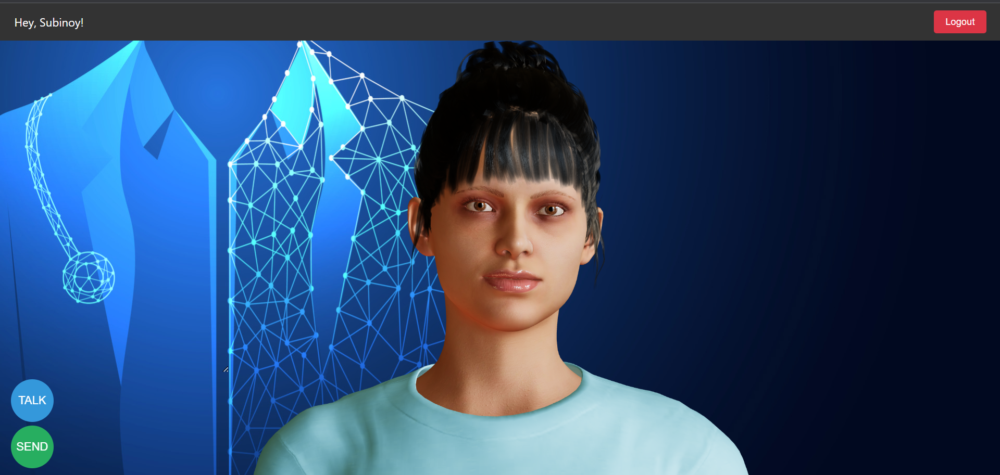

# AarogyaDisha- AI Avatar Chatbot for Your Medical Issues

## Description
The project is about a virtual doctor who will be listening to the problems of the patients in concern and will be replying to them with relevant responses and suggestions to their problems. This virtual person will be providing all the feedback in a very human like manner with even similar to human facial muscle movements and facial expressions.
The GPT-3.5-turbo AI model from OpenAI is used in the Virtual Doctor. Users speak medical questions or symptoms into the model, which provides relevant, context-aware responses, including medical advice, suggestions, and potential diagnosis. This improves user access to health information while highlighting the importance of seeking professional medical advice.
The Azure API is used by the Virtual Doctor to integrate facial expressions. The API converts responses into genuine lip motions when users engage with the virtual interface and ask it a question. This increases user engagement and results in a more authentic and relatable interaction, which contributes to a realistic and immersive experience.



## Demo
You can see a demo of this project (here)[https://youtu.be/fY_2CKBpT00]

## Requirements
- Nodejs,Reactjs on your system or on your deployment environment.
- A OpenAI API Key and a AzureAPI Key.

## Installation
To install and run YourMedic on your local machine, follow these steps:

1. Clone the repository:
   ```
   git clone https://github.com/subinoybiswas/YourMedic.git
   ```
2. Navigate to the project directory:
   ```
   cd YourMedic
   ```
3. Navigate to `Backend` (Root of the Node project):
   ```
   cd Backend
   ```
4. Install the dependencies:
   ```
   npm install
   ```
5. Navigate to `Frontend` (Root of the Node project):
   ```
   cd Frontend
   ```
6. Install the dependencies:
   ```
   yarn install
   ```

## Configuration
Before running the application, you need to set up the following configurations:

1. Create a `.env` file in the root directory of both the `Backend` and `Frontend`.
2. Specify the following environment variables in the `.env` file of the `Backend`:
   ```
   AZURE_KEY=
   AZURE_REGION=
   ```
3. In the `Frontend`, add the `.env` in the following format:
```
REACT_APP_ALTER_API=
REACT_APP_OPENAI_API_KEY=
``` 

## Backend
The backend of the project is built using Node.js and Express.js. It provides the API endpoints for sending and retrieving messages. The backend code can be found in the `Backend` directory.

To start the backend server, run the following command:
```
npm start
```

## Frontend
The front end of YourMedic is built with Reactjs and 3js. It provides the user interface for aksing questions and responding to questions. The frontend code can be found in the `Frontend` directory.

The routing for the front end is primarily handled via the `index.js` file at `Backend/index.js`. Then it gets rerouted via 

## Deployment
To deploy friend.ly to a production environment, follow these steps:

1. Set up a Firestore Database.
2. Configure the necessary environment variables in your production environment.
3. Set up the project and install the necessary dependencies.
4. Go to the correct directory (`Backend`)
5. Start the backend server:
   ```
   npm run start
   ```
6. Enjoy your app.

## Contributing
Contributions to friend.ly are welcome! If you find any bugs, have feature requests, or want to contribute code, please open an issue or submit a pull request to the project repository.
